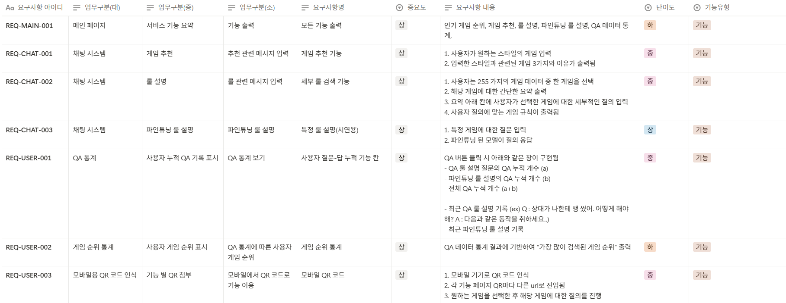
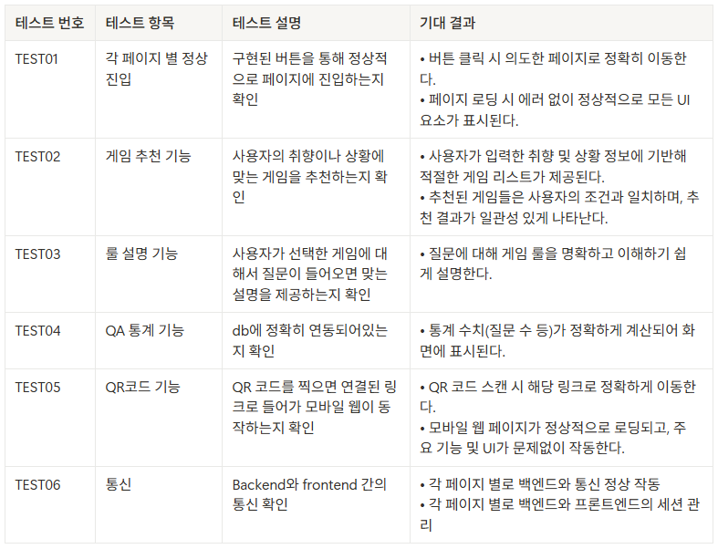
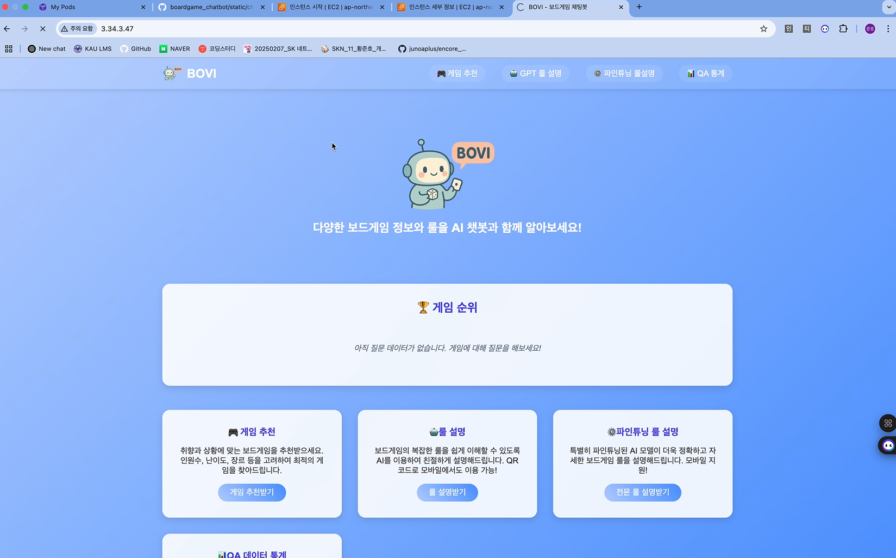
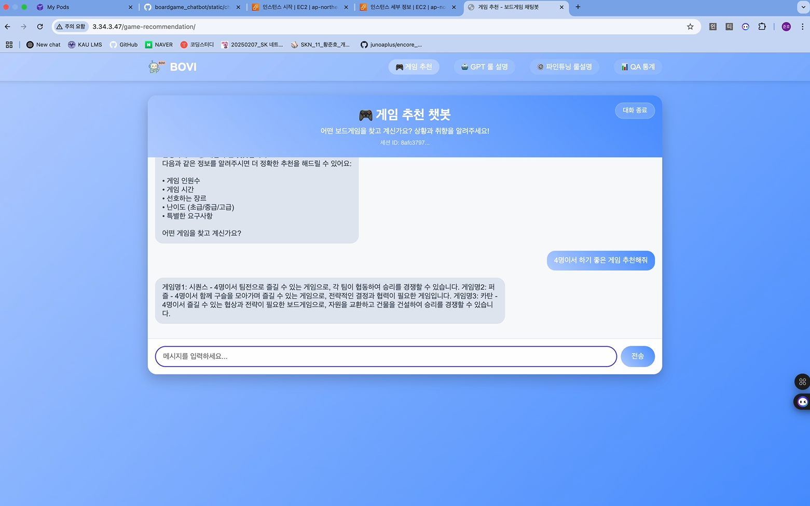
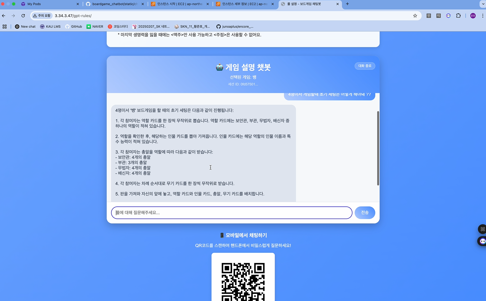
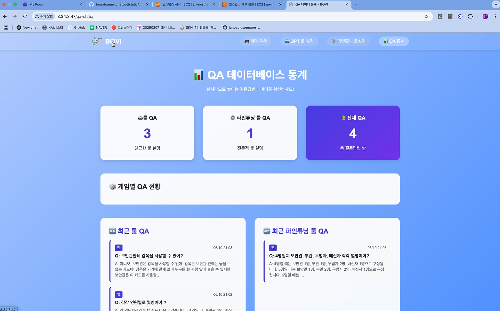
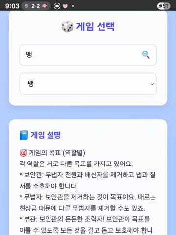

# SKN11-4TH-3Team
- 주제 : LLM 기반 보드게임 룰 설명 & 맞춤형 추천 챗봇 구동 웹 어플리케이션 개발
- 개발기간 : 25.05.16~25.06.11
---
## 📑 Index

1. [팀 소개](#1-팀-소개)
2. [Overview](#2-overview)
3. [기술 스택](#3-기술-스택)
4. [시스템 아키텍처](#4-시스템-아키텍처)
5. [WBS](#5-wbs)
6. [요구사항 명세서](#6-요구사항-명세서)
7. [화면설계서](#7-화면설계서)
8. [테스트 계획 및 결과 보고서](#8-테스트-계획-및-결과-보고서)
9. [수행결과](#9-수행결과)
10. [한 줄 회고](#10-한-줄-회고)

## 1. 팀 소개
### 팀명 : BoardNavi
- Board + Navi의 합성어로, “보드게임 세계의 길잡이” 라는 뜻으로, 사용자가 보드게임이라는 낯선 세계에서 길을 잃지 않도록 규칙과 추천을 안내해주는 팀이라는 의미를 담고 있습니다.

### 👤 팀원
<table>
  <tr>
    <td align="center">
      
    </td>
    <td align="center">
      
    </td>
    <td align="center">
      
    </td>
    <td align="center">
      
    </td>
  </tr>
  <tr>
    <td align="center">
      <a href="https://github.com/Kimjeongwon12">김정원</a>
    </td>
    <td align="center">
      <a href="https://github.com/minjung2266">이민정</a>
    </td>
    <td align="center">
      <a href="https://github.com/Minor1862">정민호</a>
    </td>
    <td align="center">
      <a href="https://github.com/junoaplus">황준호</a>
    </td>
  </tr>
</table>
 

## 2. Overview

  #### 📖 프로젝트 소개 
보드게임 봇 "🤖보비"는 보드게임 룰 설명과 추천 기능을 제공하는 LLM 기반 챗봇입니다. 챗봇은 사용자의 질문에 따라 게임 규칙을 설명하거나 취향에 맞는 게임을 추천해줍니다.

#### ⭐ 프로젝트 필요성
<table>
  <tr>
    <td>초보자들의 게임 선택 장애</td>
    <td>보드게임의 대중화로 다양한 게임이 출시되고 있지만, 초보 이용자들은 복잡한 룰을 이해하거나 자신의 취향에 맞는 게임을 고르는 데 어려움을 겪음</td>
  </tr>
  <tr>
    <td>보드게임 카페의 인력 문제</td>
    <td>보드게임 카페에서는 다양한 게임을 설명하고 추천할 수 있는 직원을 필요로 하지만, 폭넓은 게임 지식을 갖춘 인력을 채용하기란 쉽지 않음</td>
  </tr>
</table>

#### 🎯 프로젝트 목표

<table>
  <tr>
    <td>보드게임 룰 설명 챗봇 구현</td>
    <td>사용자의 질문에 정확하고 간결한 게임 규칙을 제공</td>
  </tr>
  <tr>
    <td>보드게임 추천 기능 제공</td>
    <td>게임 방법, 인원 수, 테마 등을 기반으로 유사도 분석을 통해 최적의 보드게임을 추천</td>
  </tr>
  <tr>
    <td>도메인 특화 지식 반영</td>
    <td>벡터DB 구축과 LLM 파인튜닝을 통해 보드게임에 특화된 지식 기반 챗봇 구축</td>
  </tr>
</table>

## 3. 기술 스택

| 항목                | 내용 |
|---------------------|------|
| **Language**        |  |
| **Development**     |         |
| **Embedding Model** |  |
| **Vector DB**       |  |
| **LLM Model**       |    |
|   **Framework**   |                   |
| **Collaboration Tool** | 

## 4. 시스템 구성도

## 5. WBS

## 6. 요구사항 명세서

## 7. 화면설계서

## 8. 테스트 계획 및 결과 보고서

### 📖테스트 계획

### 📖테스트 결과
- TEST01

- TEST02

- TEST03

- TEST04

- TEST05
  <table>
  <tr>
    <td>
      
    </td>
  </tr>
  </table>

## 9. 수행결과(테스트/시연 페이지)

## 10. 한 줄 회고                                                                                                               
>  김정원 :
>
> 이민정 : 
>
>  정민호 :                                                                  
>
>  황준호 : 

